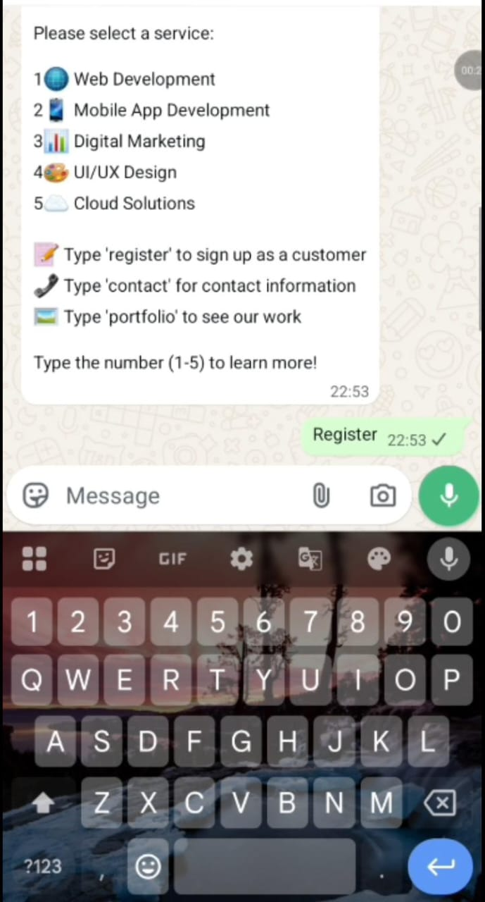
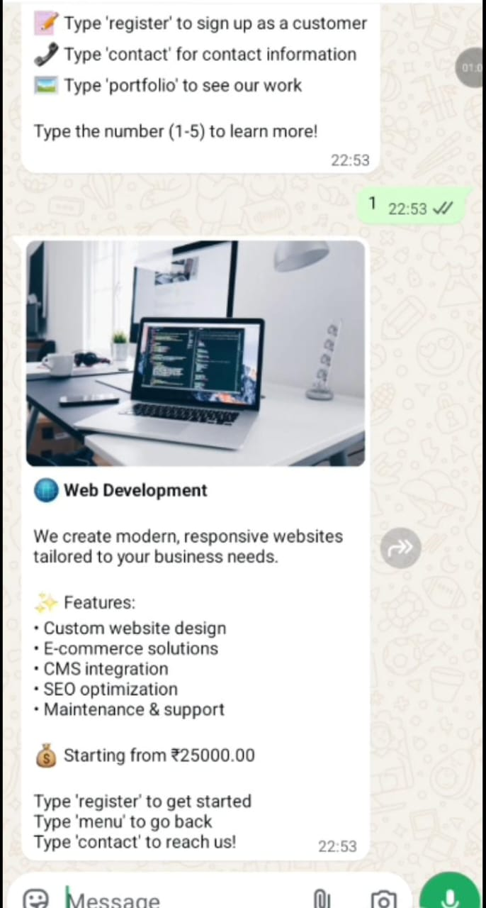
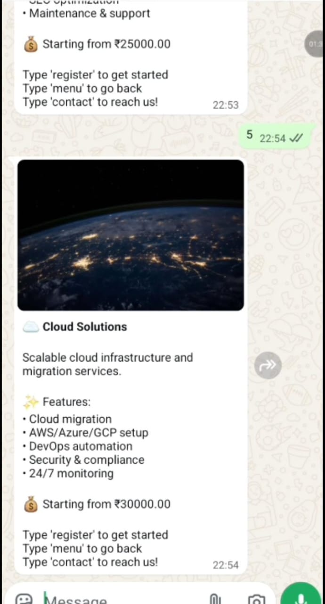
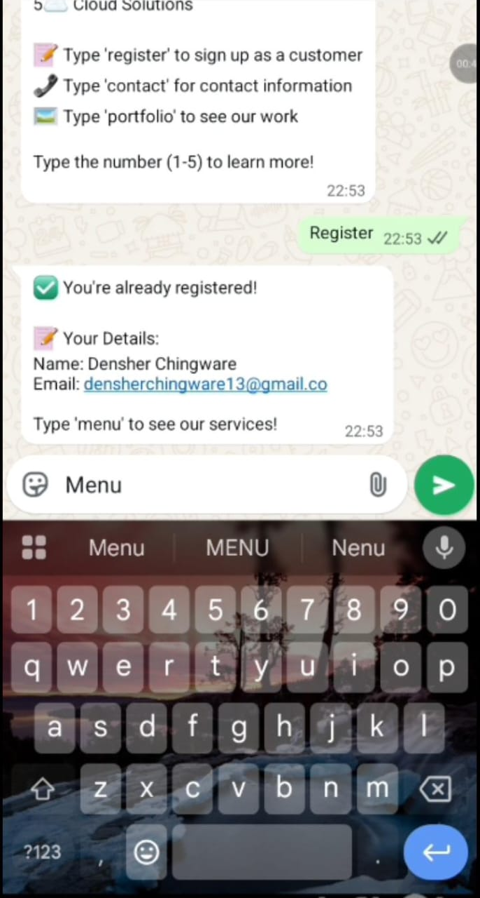
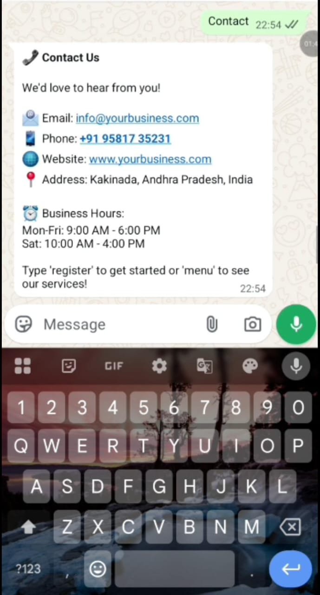

# <svg xmlns="http://www.w3.org/2000/svg" viewBox="0 0 48 48" width="48" height="48">
  <circle cx="24" cy="24" r="24" fill="#25D366"/>
  <path fill="#ffffff" d="M24 10C16.27 10 10 16.27 10 24c0 2.52.68 4.88 1.86 6.92L10 38l7.28-1.82A13.93 13.93 0 0 0 24 38c7.73 0 14-6.27 14-14S31.73 10 24 10zm6.94 19.39c-.29.82-1.7 1.57-2.33 1.67-.6.09-1.36.13-2.19-.14a20.1 20.1 0 0 1-1.98-.73c-3.49-1.51-5.77-5.04-5.94-5.27-.17-.23-1.37-1.82-1.37-3.47s.87-2.46 1.18-2.8c.31-.34.67-.42.9-.42.22 0 .45.01.64.01.21.01.49-.08.76.58.29.68 1 2.43 1.09 2.6.09.17.15.37.03.6-.12.22-.18.36-.35.56-.17.2-.36.44-.51.59-.17.17-.35.35-.15.69.2.34.9 1.48 1.93 2.4 1.33 1.18 2.45 1.55 2.79 1.72.34.17.54.14.74-.08.2-.22.87-1.01 1.1-1.36.23-.34.46-.28.77-.17.31.11 1.97.93 2.31 1.1.34.17.56.25.65.39.08.14.08.82-.21 1.63z"/>
</svg> WhatsApp Business Chatbot

A keyword-driven WhatsApp chatbot for IT service businesses that handles service discovery, customer registration, and contact information — all through simple text commands.

---

## 📸 Screenshots

### 1. Main Menu
The bot greets users with a numbered list of services and available commands.

> Users type a number (1–5) to explore a service, or use keywords like `register`, `contact`, or `portfolio`.

<p align="center">
  
</p>

---

### 2. Service Detail — Web Development
Typing `1` returns a rich service card with an image, feature list, and pricing.


<p align="center">
  
</p>
---

### 3. Service Detail — Cloud Solutions
Typing `5` shows the Cloud Solutions card with features and starting price.

<p align="center">
  
</p>

---

### 4. Registration Flow
Typing `register` checks if the user is already registered and shows their saved details.

<p align="center">
  
</p>

---

### 5. Contact Information
Typing `contact` returns the business address, phone, email, website, and business hours.

<p align="center">
  
</p>

---

## 🤖 How It Works

The bot listens for incoming WhatsApp messages and matches them against a set of **keywords** and **numbered commands**:

| User Input | Bot Response |
|------------|--------------|
| `menu` | Shows the main services menu |
| `1` | Web Development details |
| `2` | Mobile App Development details |
| `3` | Digital Marketing details |
| `4` | UI/UX Design details |
| `5` | Cloud Solutions details |
| `register` | Registers user or shows existing details |
| `contact` | Displays business contact info |
| `portfolio` | Shows previous work/portfolio |

---

## 🛠️ Services Offered

| # | Service | Starting Price |
|---|---------|----------------|
| 1 | 🌐 Web Development | ₹25,000 |
| 2 | 📱 Mobile App Development | — |
| 3 | 📊 Digital Marketing | — |
| 4 | 🎨 UI/UX Design | — |
| 5 | ☁️ Cloud Solutions | ₹30,000 |

### Web Development Features
- Custom website design
- E-commerce solutions
- CMS integration
- SEO optimization
- Maintenance & support

### Cloud Solutions Features
- Cloud migration
- AWS / Azure / GCP setup
- DevOps automation
- Security & compliance
- 24/7 monitoring

---

## 👤 User Registration

When a user types `register`, the bot either:
- **Registers them** as a new customer (collecting name & email), or
- **Displays their existing details** if they've already signed up.

**Example response for an existing user:**
```
✅ You're already registered!

📝 Your Details:
Name: Densher Chingware
Email: densherchingware13@gmail.com

Type 'menu' to see our services!
```

---

## 📞 Contact Information

```
📧 Email:   info@yourbusiness.com
📱 Phone:   +91 95817 35231
🌐 Website: www.yourbusiness.com
📍 Address: Kakinada, Andhra Pradesh, India

🕐 Business Hours:
   Mon–Fri: 9:00 AM – 6:00 PM
   Sat:     10:00 AM – 4:00 PM
```

---

## 🏗️ Tech Stack (Suggested)

| Layer | Technology |
|-------|------------|
| Messaging API | [Twilio WhatsApp API](https://www.twilio.com/whatsapp) |
| Backend | Laravel|
| Database | MySQL |
| Hosting | local |

---

## 🚀 Setup Overview

1. **Connect a WhatsApp Business number** via Twilio
2. **Set up a webhook** to receive incoming messages.
3. **Implement keyword matching** logic in your backend.
4. **Store registered users** in a database.
5. **Deploy** and link the webhook URL to your WhatsApp number.

---

## 📌 Notes

- All interactions are **text-based** — users never need to click buttons.
- Service cards include an **image + description + features + price**.
- The bot is designed for a **single-business IT services** use case but can be adapted for any domain.
- Registration is **per WhatsApp number** — no separate login required.

---

*Built for businesses looking to automate lead generation and customer engagement via WhatsApp.*
